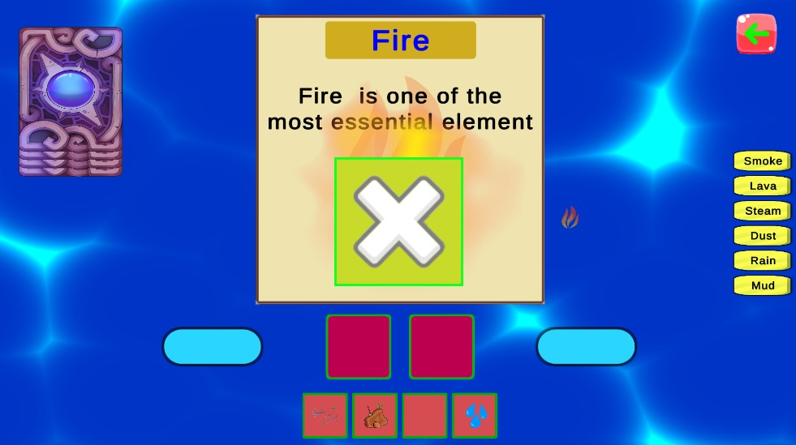

# 🧪 Item Combinations – Educational Unity Game

**Item Combinations** is an educational game developed in **Unity 6**, designed to help children learn and explore worlds concepts through fun, interactive card-based mechanics. Players combine different item cards to discover new items, all while enjoying visually engaging effects powered by Shader Graph.

---

## 🎮 Features

- 🃏 **Card-Based Interaction**  
  Drag, drop, and combine items  to simulate real-world reactions and concepts.

- 🌊 **Shader Graph Visuals**  
  Interactive visual feedback like ripples and elemental effects, built using Unity’s Shader Graph.

- 💾 **Local Data Storage**  
  Game progress, discovered combinations, and player preferences are saved locally using json file serialization.

- 👦 **Kid-Friendly Design**  
  Simplified visuals, intuitive UI, and clear educational feedback tailored for early learners.

- 📱 **Responsive UI**  
  Fully supports various resolutions and aspect ratios (tablet, mobile).

---

## 🧑‍💻 Technologies Used

- **Unity 6.0+**
- **Krita** for digital drawing
- **Shader Graph**
- **Unity UI Toolkit & Canvas**
- **Local Data Management** with  JSON

---

## Here are some screenshots of gameplay

## Screenshots

